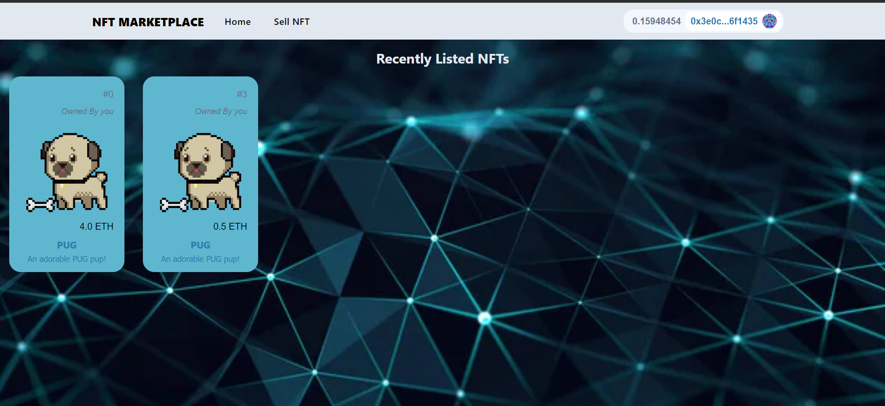
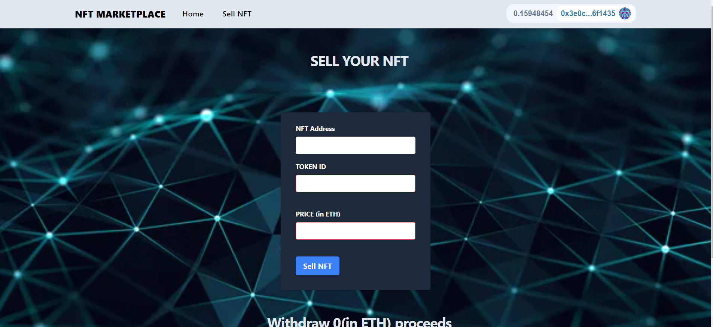

<!-- Improved compatibility of back to top link: See: https://github.com/othneildrew/Best-README-Template/pull/73 -->

<a name="readme-top"></a>

<!--
*** Thanks for checking out the Best-README-Template. If you have a suggestion
*** that would make this better, please fork the repo and create a pull request
*** or simply open an issue with the tag "enhancement".
*** Don't forget to give the project a star!
*** Thanks again! Now go create something AMAZING! :D
-->

<!-- PROJECT SHIELDS -->
<!--
*** I'm using markdown "reference style" links for readability.
*** Reference links are enclosed in brackets [ ] instead of parentheses ( ).
*** See the bottom of this document for the declaration of the reference variables
*** for contributors-url, forks-url, etc. This is an optional, concise syntax you may use.
*** https://www.markdownguide.org/basic-syntax/#reference-style-links
-->

[![Contributors][contributors-shield]][contributors-url]
[![Forks][forks-shield]][forks-url]
[![Stargazers][stars-shield]][stars-url]
[![Issues][issues-shield]][issues-url]
[![LinkedIn][linkedin-shield]][linkedin-url]

<!-- PROJECT LOGO -->
<br />
<div align="center">

<h3 align="center">NFT MARKETPLACE</h3>

  <p align="center">
     A Digital platform that connects artists and collectors, facilitating the buying, selling, and trading of unique digital assets known as Non-Fungible Tokens (NFTs), which represent ownership and authenticity of digital art, collectibles, and other digital assets."
    <br />
    <br />
    <a href="https://github.com/Harshjha3006/QuickCompete/issues">Report Bug</a>
    ·
    <a href="https://github.com/Harshjha3006/QuickCompete/issues">Request Feature</a>
  </p>
</div>

<!-- TABLE OF CONTENTS -->
<details>
  <summary>Table of Contents</summary>
  <ol>
    <li>
      <a href="#about-the-project">About The Project</a>
      <ul>
        <li><a href="#built-with">Built With</a></li>
      </ul>
    </li>
    <li>
      <a href="#getting-started">Getting Started</a>
      <ul>
        <li><a href="#prerequisites">Prerequisites</a></li>
        <li><a href="#installation">Installation</a></li>
      </ul>
    </li>
    <li><a href="#usage">Usage</a></li>
    <li><a href="#contributing">Contributing</a></li>
    <li><a href="#contact">Contact</a></li>
  </ol>
</details>

<!-- ABOUT THE PROJECT -->

## About The Project

<div >
<br>
</img>
<br><br>
</img>
<div>
 <h3>FRONTEND</h3>
 <p>The Frontend is built using React and Tailwind CSS </p>
 <h3>BACKEND</h3>
 <p>The Backend uses a Smart Contract built using the Hardhat Framework and deployed on the Sepolia Test Network</p>
 <p>GitHub Repository : <a href = "https://github.com/Harshjha3006/NFT-MarketPlace-Backend">NFT-MarketPlace-Backend</a></p>
 <h3>DATABASE</h3>
 <p>Data is fetched from the Graph Protocol which indexes events emitted by the Smart Contract in a fully decentralized manner</p>
 <p>GitHub Repository : <a href = "https://github.com/Harshjha3006/Graph-NFT-MarketPlace">Graph-NFT-MarketPlace</a> </p>
</div>
</div>
<p align="right">(<a href="#readme-top">back to top</a>)</p>

### Built With

- [![React][React.js]][React-url]
- 
- 
- 
- <a href = "https://hardhat.org/">HARDHAT</a>
- <a href = "https://thegraph.com/">THE GRAPH PROTOCOL</a>

<p align="right">(<a href="#readme-top">back to top</a>)</p>

<!-- GETTING STARTED -->

## Getting Started

This is an example of how you may give instructions on setting up your project locally.
To get a local copy up and running follow these simple example steps.

### Prerequisites

This is an example of how to list things you need to use the software and how to install them.

- [git v2.34.1](https://git-scm.com/book/en/v2/Getting-Started-Installing-Git)
  - You'll know you did it right if you can run `git --version` and you see a response like `git version 2.34.1`
- [Nodejs v18.12.0](https://nodejs.org/en/)
  - You'll know you've installed nodejs right if you can run:
    - `node --version` and get an output like: `v18.12.0`
- [Yarn v1.22.19](https://yarnpkg.com/)
  - You'll know you've installed yarn right if you can run:
    - `yarn --version` and get an output like : `1.22.19`

### Installation

1. Clone the repo
   ```sh
   git clone https://github.com/Harshjha3006/NFT-MarketPlace-Frontend
   cd NFT-MarketPlace-Frontend
   ```
2. Install yarn packages
   ```sh
   yarn
   ```
3. Run the development build at localhost:3000
   ```sh
   yarn start
   ```

<p align="right">(<a href="#readme-top">back to top</a>)</p>

<!-- CONTRIBUTING -->

## Contributing

Contributions are what make the open source community such an amazing place to learn, inspire, and create. Any contributions you make are **greatly appreciated**.

If you have a suggestion that would make this better, please fork the repo and create a pull request. You can also simply open an issue with the tag "enhancement".
Don't forget to give the project a star! Thanks again!

1. Fork the Project
2. Create your Feature Branch (`git checkout -b feature/AmazingFeature`)
3. Commit your Changes (`git commit -m 'Add some AmazingFeature'`)
4. Push to the Branch (`git push origin feature/AmazingFeature`)
5. Open a Pull Request

<p align="right">(<a href="#readme-top">back to top</a>)</p>

<p align="right">(<a href="#readme-top">back to top</a>)</p>

<!-- CONTACT -->

## Contact

Harsh Jha - harsh30jha@gmail.com

Project Link: [https://github.com/Harshjha3006/QuickCompete](https://github.com/Harshjha3006/QuickCompete)

<p align="right">(<a href="#readme-top">back to top</a>)</p>

<!-- ACKNOWLEDGMENTS -->

<p align="right">(<a href="#readme-top">back to top</a>)</p>

<!-- MARKDOWN LINKS & IMAGES -->
<!-- https://www.markdownguide.org/basic-syntax/#reference-style-links -->

[contributors-shield]: https://img.shields.io/github/contributors/Harshjha3006/QuickCompete.svg?style=for-the-badge
[contributors-url]: https://github.com/Harshjha3006/QuickCompete/graphs/contributors
[forks-shield]: https://img.shields.io/github/forks/Harshjha3006/QuickCompete.svg?style=for-the-badge
[forks-url]: https://github.com/Harshjha3006/QuickCompete/network/members
[stars-shield]: https://img.shields.io/github/stars/Harshjha3006/QuickCompete.svg?style=for-the-badge
[stars-url]: https://github.com/Harshjha3006/QuickCompete/stargazers
[issues-shield]: https://img.shields.io/github/issues/Harshjha3006/QuickCompete.svg?style=for-the-badge
[issues-url]: https://github.com/Harshjha3006/QuickCompete/issues
[license-shield]: https://img.shields.io/github/license/Harshjha3006/QuickCompete.svg?style=for-the-badge
[license-url]: https://github.com/Harshjha3006/QuickCompete/blob/master/LICENSE.txt
[linkedin-shield]: https://img.shields.io/badge/-LinkedIn-black.svg?style=for-the-badge&logo=linkedin&colorB=555
[linkedin-url]: https://www.linkedin.com/in/harsh-jha-3060b022a/
[product-screenshot]: ./src/img/website%20screenshot.png
[Next.js]: https://img.shields.io/badge/next.js-000000?style=for-the-badge&logo=nextdotjs&logoColor=white
[Next-url]: https://nextjs.org/
[React.js]: https://img.shields.io/badge/React-20232A?style=for-the-badge&logo=react&logoColor=61DAFB
[React-url]: https://reactjs.org/
[Vue.js]: https://img.shields.io/badge/Vue.js-35495E?style=for-the-badge&logo=vuedotjs&logoColor=4FC08D
[Vue-url]: https://vuejs.org/
[Angular.io]: https://img.shields.io/badge/Angular-DD0031?style=for-the-badge&logo=angular&logoColor=white
[Angular-url]: https://angular.io/
[Svelte.dev]: https://img.shields.io/badge/Svelte-4A4A55?style=for-the-badge&logo=svelte&logoColor=FF3E00
[Svelte-url]: https://svelte.dev/
[Laravel.com]: https://img.shields.io/badge/Laravel-FF2D20?style=for-the-badge&logo=laravel&logoColor=white
[Laravel-url]: https://laravel.com
[Tailwind.com]: https://img.shields.io/badge/Bootstrap-563D7C?style=for-the-badge&logo=bootstrap&logoColor=white
[Bootstrap-url]: https://getbootstrap.com
[JQuery.com]: https://img.shields.io/badge/jQuery-0769AD?style=for-the-badge&logo=jquery&logoColor=white
[JQuery-url]: https://jquery.com
[def]: https://github.com/Harshjha3006/QuickCompete/src/img/demo.gif
